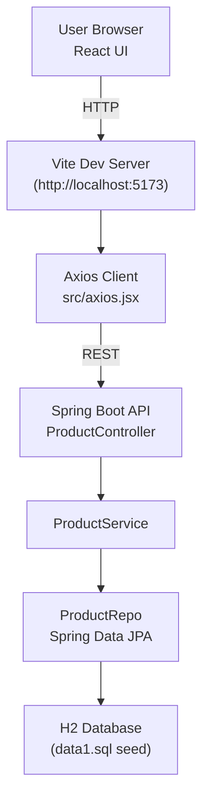
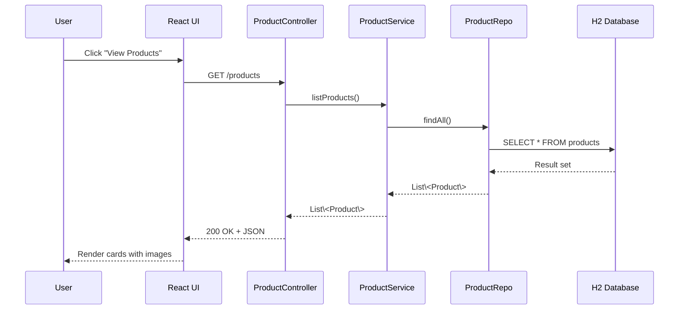

# Spring & Spring Boot Learning Guide

## About This Sample
This repository hosts a full-stack ecommerce demo: a Spring Boot backend under `src/main/java/com/example/ecommerce_sample` and a Vite/React client in `ecom-frontend-5`. Use it as a sandbox while you explore Spring concepts described below.

## Architecture Overview
The React frontend talks to the Spring Boot API over REST, while the API delegates persistence to Spring Data JPA against the in-memory H2 database seeded via `data1.sql`.

## Prerequisites
- Java 17+ (match the version in `pom.xml`).
- Maven Wrapper (`./mvnw.cmd` on Windows) plus Node.js 18+ for the frontend.
- An IDE with Spring tooling such as IntelliJ IDEA, VS Code with the Spring extensions, or Eclipse STS.

## Spring Core Concepts
- **Inversion of Control (IoC)**: Spring owns object creation. Components are declared as beans (e.g., `ProductService`) and injected where needed, rather than instantiated manually.
- **Dependency Injection (DI)**: Wiring happens via constructor, field, or setter injection. Prefer constructor injection for required collaborators; the container resolves dependencies from its registry.
- **ApplicationContext**: The runtime container that manages bean lifecycle, resource loading, profiles, and environment properties. `@SpringBootApplication` bootstraps the context.
- **Bean Scopes & Lifecycle**: Default scope is singleton. Use `@Scope("prototype")` or web scopes when needed. Lifecycle callbacks include `@PostConstruct`, `@PreDestroy`, and interface-based hooks.

## Configuration Styles
- **Annotation-Based**: Mark classes with stereotypes (`@Controller`, `@Service`, `@Repository`, `@Component`).
- **Java Config**: Use `@Configuration` classes with `@Bean` methods for explicit wiring.
- **Property Management**: Externalize values in `application.properties` or `application.yml`; bind them via `@Value` or `@ConfigurationProperties` for strongly typed configs.

## Spring Boot Essentials
- **Auto-Configuration**: Boot inspects the classpath and configuration to supply sensible defaults. Override behaviour by defining your own beans or using `spring.autoconfigure.exclude`.
- **Starters**: `spring-boot-starter-web`, `spring-boot-starter-data-jpa`, and others bundle dependencies for a particular slice of functionality.
- **Executable Jars & Devtools**: `./mvnw.cmd spring-boot:run` launches the app with hot reload support via DevTools (if on the classpath).
- **Application Profiles**: Create `application-dev.properties`, `application-prod.properties`, etc., and activate them with `--spring.profiles.active=dev`.
- **Actuator**: Add `spring-boot-starter-actuator` for health checks, metrics, and environment endpoints.

## Web Layer (Spring MVC & REST)
- `@RestController` combines `@Controller` and `@ResponseBody` for JSON APIs. `ProductController` is the local example.
- **Request Mapping**: Use `@GetMapping`, `@PostMapping`, etc. Path variables (`@PathVariable`) and query params (`@RequestParam`) bind HTTP input.
- **DTOs & Validation**: Shape network payloads using DTO records or classes; annotate fields with Bean Validation constraints (`@NotNull`, `@Size`). Add `@Valid` on controller parameters to trigger validation.
- **Exception Handling**: Centralize error responses with `@ControllerAdvice` + `@ExceptionHandler`. Return problem details or custom bodies with `ResponseEntity`.

## Data Access with Spring Data JPA
- **Entities**: Annotate domain classes with `@Entity`, map columns with JPA annotations, and use Lombok or standard getters/setters.
- **Repositories**: Extend `JpaRepository` (see `ProductRepo`) to get CRUD, pagination, sorting, and derived queries (`findByNameContaining`).
- **Transactions**: Use `@Transactional` on service methods that manipulate data. By default, repository methods run in transactions.
- **Database Profiles**: Start with the embedded H2 database for development; switch to PostgreSQL/MySQL in production by updating the datasource properties.

## Working with Files & Binary Data
- Spring MVC supports multipart uploads via `MultipartFile` as used in `ProductService`. Configure `spring.servlet.multipart.*` properties to manage file size limits.
- Consider storing images on disk or object storage in production to avoid large BLOB columns.

## Security Basics
- Add `spring-boot-starter-security` to enforce authentication. Define an `SecurityFilterChain` bean for HTTP security rules.
- Use method-level security (`@PreAuthorize`) once you enable it with `@EnableMethodSecurity`.
- Externalize credentials and secrets using environment variables or a secrets manager; never commit them to source control.

## Observability & Health
- With Actuator, expose `/actuator/health`, `/actuator/metrics`, and `/actuator/loggers` for diagnostics.
- Integrate Micrometer with monitoring stacks (Prometheus, New Relic) for production telemetry.

## Testing Spring Applications
- **Unit Tests**: Use JUnit 5 + Mockito for isolated logic (e.g., service layer).
- **Slice Tests**: `@WebMvcTest` for controllers, `@DataJpaTest` for repositories, and `@RestClientTest` for HTTP clients.
- **Full Integration**: `@SpringBootTest` loads the entire context; leverage it sparingly because it is slower.
- **Testcontainers**: Replace in-memory databases with real ones using Testcontainers for realistic integration tests.

## Running This Project
1. Start the backend: `./mvnw.cmd spring-boot:run` (or `./mvnw spring-boot:run` on Unix).
2. Seed data loads from `src/main/resources/data1.sql` on startup.
3. Start the frontend: change into `ecom-frontend-5` and run `npm install` followed by `npm run dev`. By default Vite serves on `http://localhost:5173`.
4. Update API URLs in the React client under `src/axios.jsx` if you change backend ports.

## Learning Roadmap
1. Build a simple REST endpoint and test it with cURL or Postman.
2. Add a custom repository query and expose it via the controller.
3. Introduce validation rules and global exception handling.
4. Enable Spring Security with basic auth, then explore JWT/OAuth.
5. Add caching (`spring-boot-starter-cache`) and measure outcomes with Actuator metrics.

## Further Reading & Resources
- [Spring Boot Reference Documentation](https://docs.spring.io/spring-boot/docs/current/reference/html/).
- [Spring Framework Reference Guide](https://docs.spring.io/spring-framework/docs/current/reference/html/).
- [Baeldung Spring Tutorials](https://www.baeldung.com/spring-tutorial).
- [Spring Academy](https://academy.spring.io/) for guided courses and workshops.
- [Testcontainers](https://testcontainers.com/) for realistic integration testing.

## Contributing Notes
Use this README as a learning hub, but follow `AGENTS.md` for repository-specific contribution etiquette, naming conventions, and workflow expectations.
